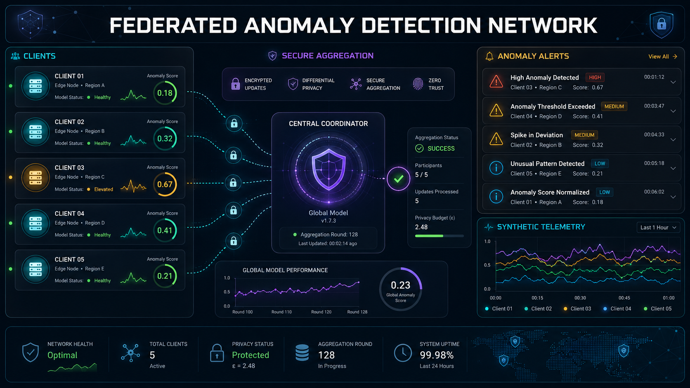
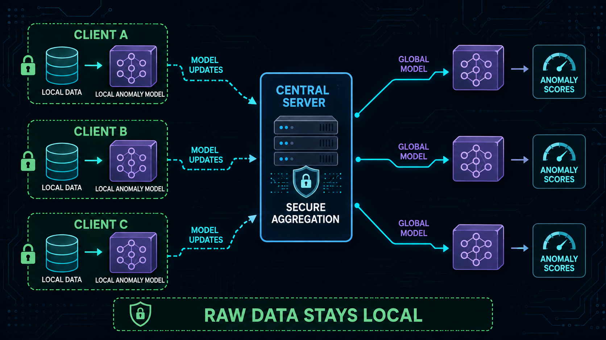
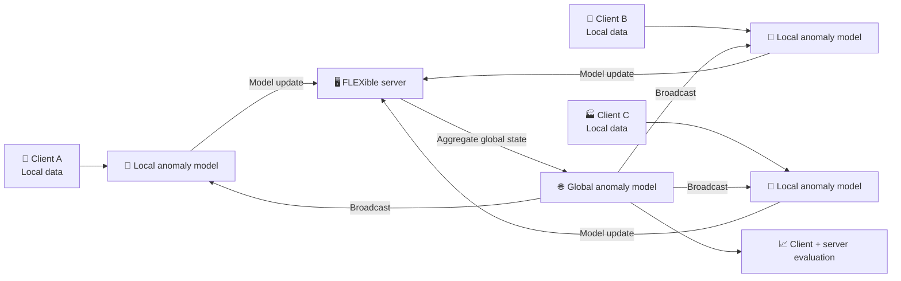
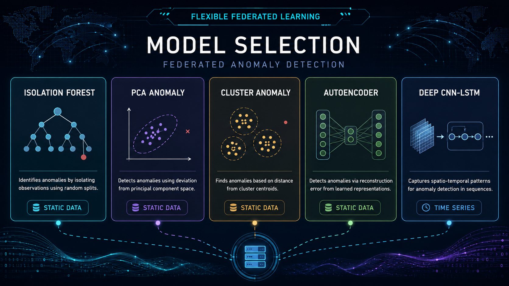
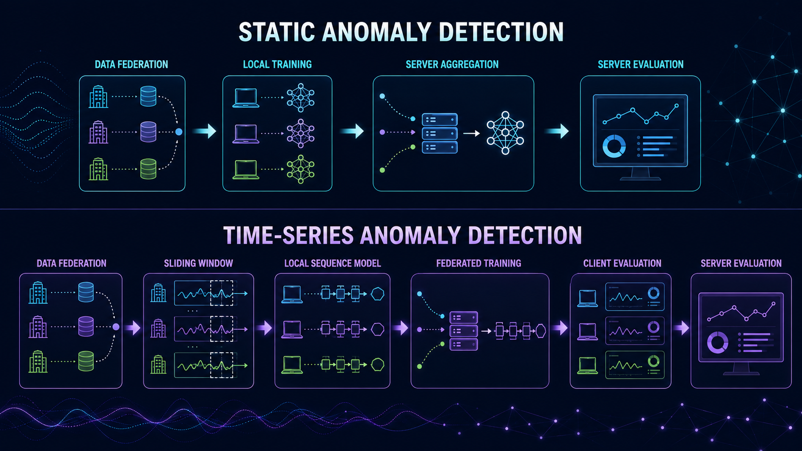
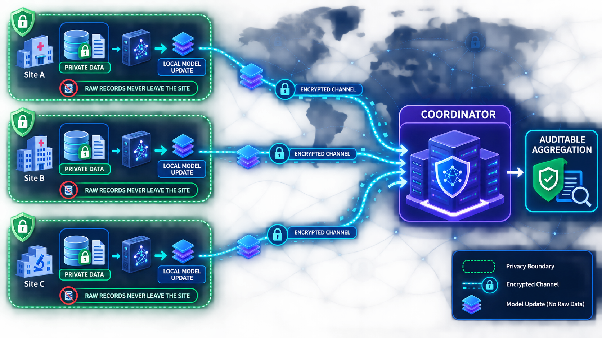
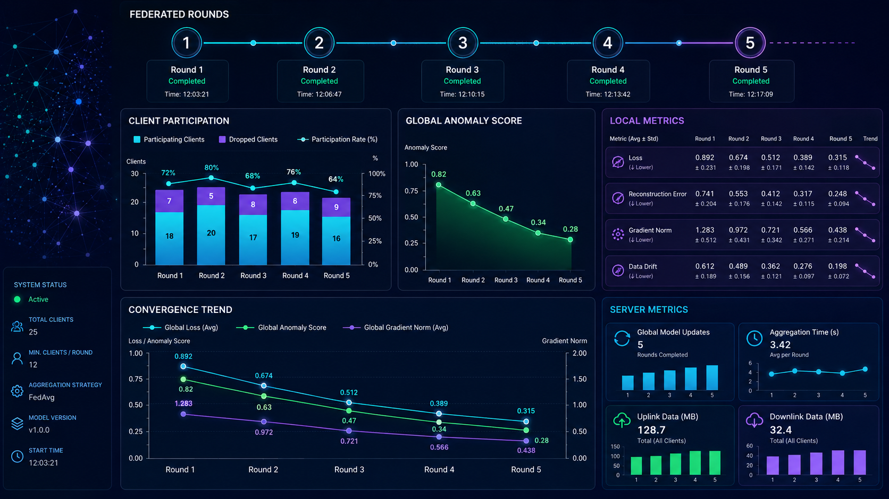
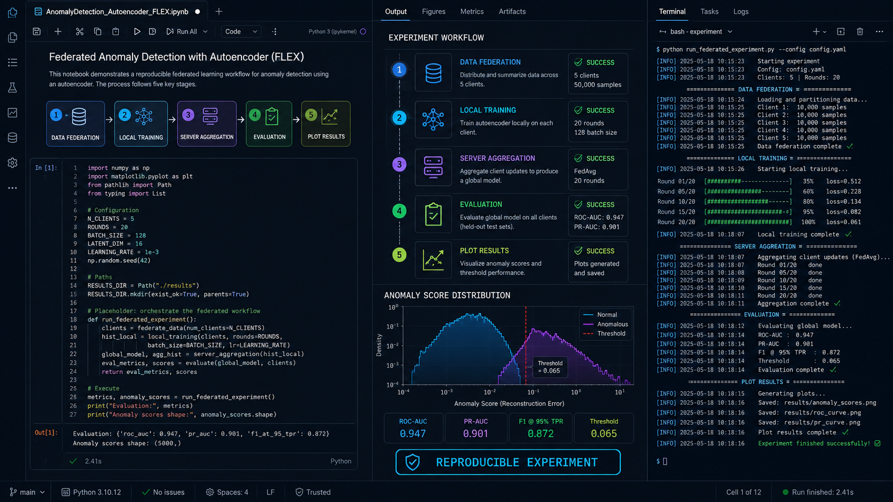

<div align="center">



# 🌐 Federated Anomaly Detection Network

### Privacy-aware anomaly detection experiments across distributed clients

**FLEXible federated learning · Classical ML · Deep sequence models · Client/server evaluation**

[](https://www.python.org/)
[](https://github.com/FLEXible-FL/FLEXible)
[](#-model-catalog)
[](https://jupyter.org/)
[](LICENSE)

[Overview](#-overview) · [Architecture](#-federated-architecture) · [Models](#-model-catalog) · [Notebooks](#-notebook-lab) · [Setup](#-installation) · [Privacy](#-privacy-and-responsible-use)

</div>

> [!IMPORTANT]
> This repository is a research and educational implementation. The README visuals use simulated telemetry and are not proof of a production privacy guarantee or detection accuracy. Any real deployment needs threat modeling, secure aggregation, authenticated clients, differential-privacy analysis, drift monitoring, and human review.

## 🌐 Overview

**Federated Anomaly Detection Network** explores anomaly detection when data is distributed across multiple participants. It combines the [FLEXible](https://github.com/FLEXible-FL/FLEXible) federated-learning library with reusable anomaly-detection primitives, score processing, metrics, and data-preparation utilities.

The project covers both static data and time series. Each notebook demonstrates how a model can be trained across simulated clients, aggregated at a server, and evaluated at client and global levels. The design keeps the learning workflow modular so the same experiment can compare tree, projection, clustering, autoencoder, and convolutional-recurrent approaches.

### ✨ At a glance

| Area | What this project demonstrates |
|---|---|
| Federated workflow | Client-local training, server aggregation, and global evaluation through FLEXible |
| Anomaly families | Distance/projection, density/cluster, isolation-tree, reconstruction, and sequence models |
| Data modes | Static tabular data and time-series windows |
| Reusable utilities | Data loading, federation helpers, score processing, and evaluation metrics |
| Learning artifacts | Explanatory notebooks with step-by-step experiment flow |
| Privacy posture | Raw records are intended to remain at the client boundary in the federated simulation; production controls are still required |

## 🚀 Core capabilities

- 🔒 **Federated anomaly experiments** with local client datasets and server-side aggregation.
- 🌲 **Isolation Forest** for tree-based outlier isolation.
- 📐 **PCA Anomaly** for projection-based distance scoring.
- 🧩 **Cluster Anomaly** using distance to large cluster centers.
- 🧠 **AutoEncoder** reconstruction error for static and temporal data.
- 🌀 **DeepCNN-LSTM** sequence modeling for time-series anomaly patterns.
- 📊 **Anomaly-score processing** and metrics utilities for consistent evaluation.
- 🧪 **Notebook-first teaching workflow** covering federation, training, and client/server analysis.
- 🧱 **FLEXible-compatible structure** for extending aggregators, primitives, datasets, and utilities.

## 🏗️ Federated architecture





### 🔄 Training lifecycle

1. **Federate the experiment:** partition an approved dataset into client-local subsets.
2. **Initialize:** create the selected anomaly model and client/server configuration.
3. **Train locally:** each client fits or updates its local model using only its local partition.
4. **Aggregate:** FLEXible combines the client contributions according to the configured strategy.
5. **Broadcast:** the global state is returned to participating clients for the next round.
6. **Evaluate:** compare local behavior with global/server results and inspect anomaly scores.

> The simulation demonstrates a federated pattern; it should not be read as a complete privacy system. Transport security, client authentication, update confidentiality, poisoning defenses, and leakage analysis remain deployment responsibilities.

## 🖼️ Visual product tour

> [!NOTE]
> These are high-fidelity concept illustrations created for the portfolio README. They use synthetic labels and telemetry to communicate the workflow; they are not screenshots of a live federated network.

### 🧭 Network overview

The hero view presents a distributed anomaly-monitoring control plane with clients, a coordinator, global scores, and review signals.

### 🧠 Model catalog



The catalog groups the implemented approaches by their modeling intuition and static/time-series use case.

### 📚 Static and time-series workflows



Static experiments use federated feature representations; temporal experiments add sliding windows and sequence-aware evaluation.

### 🔐 Raw-data boundary



The intended boundary is explicit: client records remain local while model updates travel to the coordinator. A production system must add cryptographic and operational controls around that boundary.

### 📈 Federated rounds and metrics



Round-level charts help compare participation, local metrics, server metrics, and convergence trends.

### 💻 Notebook workflow



The notebooks are the main learning surface: prepare data, federate clients, train locally, aggregate globally, and plot results.

## 🧠 Model catalog

| Model | Modeling idea | Best suited for |
|---|---|---|
| **IsolationForest** | Isolates unusual points through randomized tree partitions | Static tabular anomaly scores |
| **PCA_Anomaly** | Scores distance from a principal-component subspace | Low-dimensional structure and projection residuals |
| **ClusterAnomaly** | Measures distance to a large cluster center | Clustered static data with sparse outliers |
| **AutoEncoder** | Learns a reconstruction representation and scores reconstruction error | Static data and time-series windows |
| **DeepCNN_LSTM** | Combines convolutional feature extraction with recurrent sequence modeling | Temporal and spatio-temporal patterns |

Model choice should be driven by data shape, stationarity, client heterogeneity, compute budget, and the cost of false alerts—not by a single headline metric.

## 🧰 Repository structure

```text
Federated-Anomaly-Detection-Network/
├── flexanomalies/
│   ├── pool/                 # FLEXible-compatible aggregators and model primitives
│   ├── utils/                # Federation, loading, score processing, and metrics
│   └── datasets/             # Dataset preparation and preprocessing helpers
├── notebooks/
│   ├── AnomalyDetection_Autoencoder_FLEX.ipynb
│   ├── AnomalyDetection_AutoEncoder_FLEX_ts.ipynb
│   ├── AnomalyDetection_PCA_FLEX.ipynb
│   ├── AnomalyDetection_Cluster_FLEX.ipynb
│   ├── AnomalyDetection_IsolationForest_FLEX.ipynb
│   └── AnomalyDetection_CNNN_LSTM_FLEX_ts.ipynb
├── requirements.txt
├── LICENSE
└── README.md
```

## 📓 Notebook lab

| Notebook | Focus |
|---|---|
| `AnomalyDetection_Autoencoder_FLEX.ipynb` | AutoEncoder anomaly detection for static data with federated training |
| `AnomalyDetection_AutoEncoder_FLEX_ts.ipynb` | Sliding-window AutoEncoder workflow for time series |
| `AnomalyDetection_PCA_FLEX.ipynb` | PCA-based anomaly scoring over federated static clients |
| `AnomalyDetection_Cluster_FLEX.ipynb` | Cluster-distance anomaly scoring and test-set evaluation |
| `AnomalyDetection_IsolationForest_FLEX.ipynb` | Isolation Forest from data federation through evaluation |
| `AnomalyDetection_CNNN_LSTM_FLEX_ts.ipynb` | CNN-LSTM sequence modeling for time-series anomalies |

### Suggested reading order

1. Start with `AnomalyDetection_PCA_FLEX.ipynb` to understand the smallest static workflow.
2. Read `AnomalyDetection_IsolationForest_FLEX.ipynb` for tree-based isolation.
3. Compare `AnomalyDetection_Cluster_FLEX.ipynb` for cluster-distance scoring.
4. Move to `AnomalyDetection_Autoencoder_FLEX.ipynb` for learned reconstruction.
5. Use the time-series AutoEncoder and CNN-LSTM notebooks for sliding windows and sequence evaluation.

## ⚙️ Installation

### Prerequisites

- Python 3.8 or newer
- `pip` and a virtual environment
- Jupyter Notebook or JupyterLab
- An approved dataset or a synthetic dataset for experimentation

### Install the package

```bash
git clone https://github.com/AsadAliEng/Federated-Anomaly-Detection-Network.git
cd Federated-Anomaly-Detection-Network

python -m venv .federatedvenv

# Windows PowerShell
.\.federatedvenv\Scripts\Activate.ps1

# macOS / Linux
# source .federatedvenv/bin/activate

python -m pip install --upgrade pip
python -m pip install flexanomalies
python -m pip install -r requirements.txt
```

For local development from a checked-out package source, prefer an editable install when packaging metadata is present:

```bash
python -m pip install -e .
```

### Launch notebooks

```bash
jupyter notebook
```

Open the notebooks under `notebooks/` and run cells in order. Start with a small synthetic dataset before connecting any sensitive or large data source.

## 🧪 Evaluation guidance

Anomaly scores are not automatically probabilities. For each experiment, document:

- the client partitioning strategy and degree of non-IID behavior;
- the aggregation algorithm and number of federated rounds;
- the score threshold and how it was selected;
- client-level and server/global metrics;
- false-alert review capacity and the cost of missed anomalies;
- random seeds, software versions, and dataset snapshot identifiers.

Compare models with suitable anomaly metrics such as precision/recall at a review budget, PR-AUC where labels exist, detection delay for time series, calibration of scores, and stability across clients. Avoid relying on accuracy when anomalies are rare.

## 🔒 Privacy and responsible use

- **Raw-data locality is an architecture goal, not a guarantee.** Model updates can leak information; evaluate update privacy before deployment.
- Add authenticated clients, encrypted transport, secure aggregation, access control, and audit logs around the federation service.
- Consider differential privacy, clipping, robust aggregation, and poisoning defenses for hostile or compromised clients.
- Never place customer records, credentials, private keys, or raw telemetry in notebooks, screenshots, or public reports.
- Treat anomaly alerts as review signals, not automatic proof of malicious behavior.
- Check disparate alert rates across clients and populations before using the model in a high-impact workflow.
- Retain only the logs and model artifacts required for reproducibility, incident response, and approved governance.

## 🧭 Roadmap

- [ ] Add robust aggregation and client-update anomaly detection.
- [ ] Add differential-privacy and secure-aggregation experiments.
- [ ] Add non-IID partition benchmarks and client-dropout simulations.
- [ ] Add threshold calibration and review-budget evaluation.
- [ ] Add temporal drift and concept-drift monitoring.
- [ ] Add reproducible environment locks and CI notebook checks.
- [ ] Add model-card style documentation for every anomaly detector.

## 🤝 Contributing

1. Fork the repository and create a focused branch.
2. Add a notebook or utility with a clear client/server evaluation story.
3. Include tests for preprocessing, score processing, and aggregation behavior where possible.
4. Keep experiments reproducible and use synthetic or authorized data only.
5. Document assumptions, limitations, and privacy implications in the pull request.

## 📚 Origin, citations & license

This portfolio presentation is based on the [`FLEX-Anomalies`](https://github.com/FLEXible-FL/FLEX-Anomalies) research repository and the [`FLEXible`](https://github.com/FLEXible-FL/FLEXible) federated-learning library. The implemented model families also reference the original Isolation Forest, PCA anomaly, clustering, and deep time-series research listed in the project materials.

Relevant references:

- Liu, Ting, and Zhou — [Isolation Forest](https://ieeexplore.ieee.org/document/4781136)
- Shyu et al. — [PCA-based anomaly detection](https://www.researchgate.net/publication/228709094_A_Novel_Anomaly_Detection_Scheme_Based_on_Principal_Component_Classifier)
- Chawla and Gionis — [Cluster-based outlier detection](https://epubs.siam.org/doi/10.1137/1.9781611972832.21)
- Aguilera-Martos et al. — [TSFEDL deep time-series architectures](https://arxiv.org/abs/2206.03179)

Licensed under the **MIT License**. See [`LICENSE`](LICENSE) for the complete terms.

## 👨‍💻 Developer

<table>
  <tr>
    <td width="150" align="center">
      <br>
      <strong>Asad Ali</strong>
    </td>
    <td>
      <strong>AI, Blockchain & Software Engineer</strong><br><br>
      🐙 GitHub: <a href="https://github.com/AsadAliEng">@AsadAliEng</a><br>
      📧 Email: <a href="mailto:asadali.cryptoeng@gmail.com">asadali.cryptoeng@gmail.com</a><br>
      🚀 Focus: intelligent systems, federated ML, AI security, Web3 products, automation, and production-oriented engineering
    </td>
  </tr>
</table>

---

<div align="center">

### ⭐ Learn from distributed data without moving every raw record

**Federate responsibly · Measure across clients · Keep privacy assumptions explicit**

</div>
